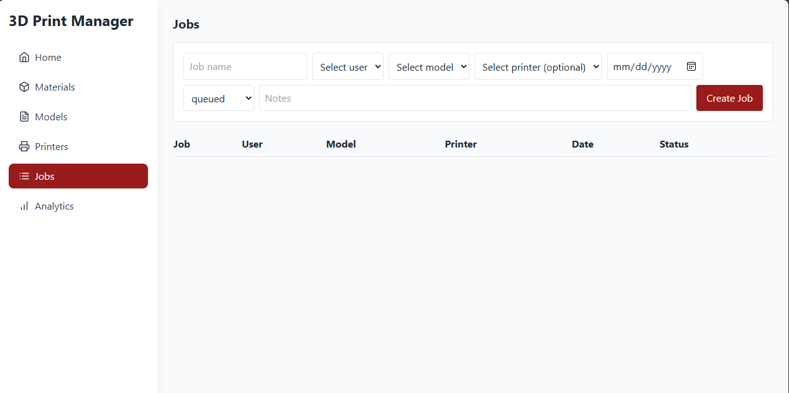
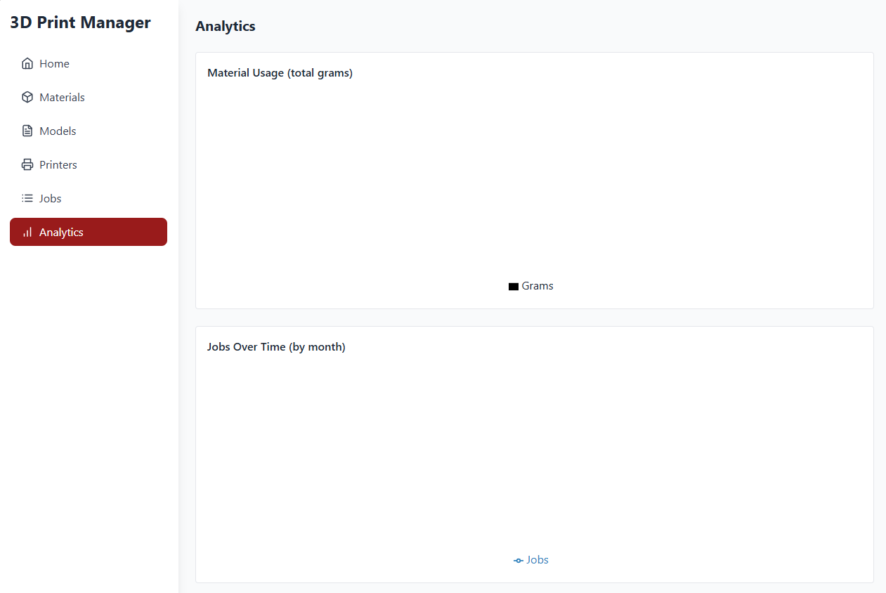
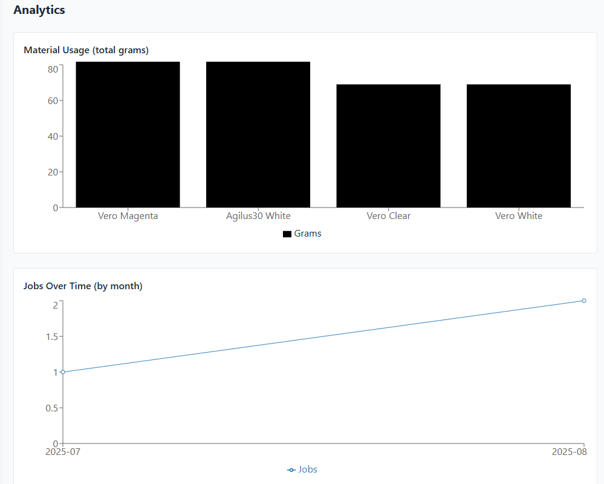

# Purpose

This project was made to easily track completed 3D printing jobs

## Available Scripts
Make sure to run npm install in respective folder
In the project directory, you can run:

### `docker compose up --build -d`
Run this in the top-level directory to start the web-app
--build flag to build the project
-d flag for detatched mode in console

### `docker compose down -v`
Brings down the web-app containers
-v flag to wipe the volume. In other words, reset database

### `npm run dev`
Navigate to the frontend folder
Runs the app in the development mode.
Open [http://localhost:3000](http://localhost:3000) to view it in your browser.

The page will reload when you make changes.
You may also see any lint errors in the console.

### `node server.js`
Starts the backend server at [http://localhost:5000](http://localhost:5000)

### `npm run ts-node backup.ts`
Creates a backup of the database
To restore `psql "your_destination_database_url" < backup.sql`